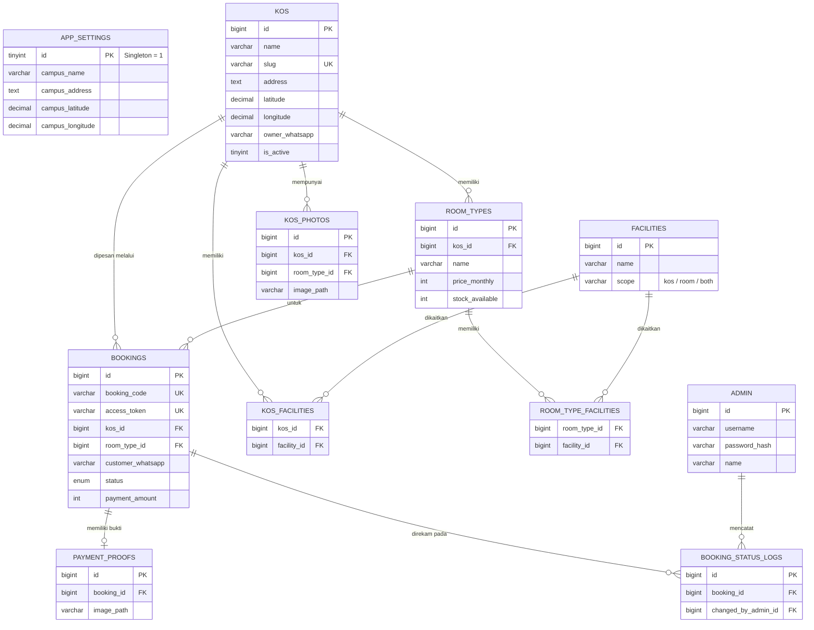
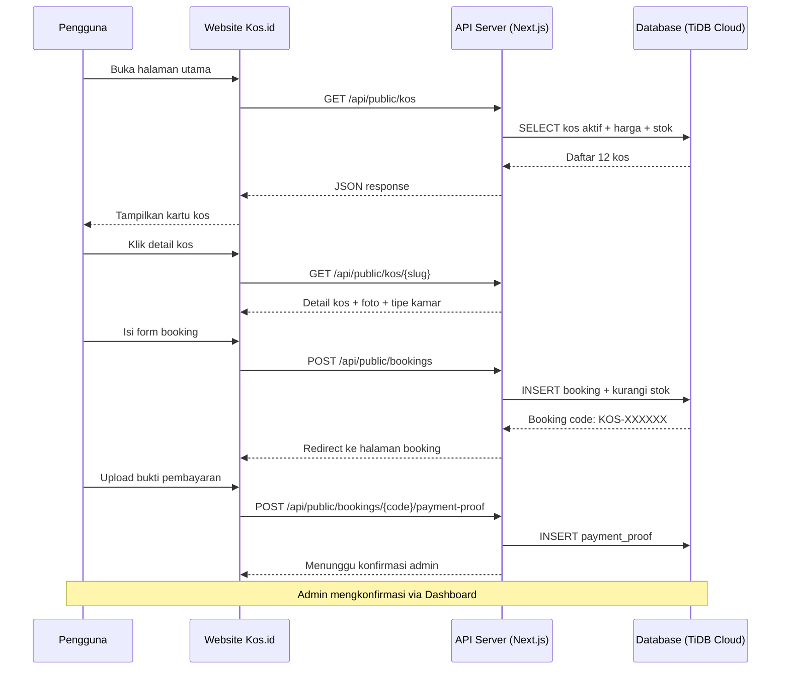

<div align="center">
  
  <h1 align="center">Sistem Informasi Manajemen Kos & Pemesanan (MVP)</h1>
  
  <p align="center">
    Platform modern untuk pencarian dan pemesanan kos di sekitar area kampus, dilengkapi dengan dashboard admin yang komprehensif.
  </p>

  <p align="center">
    
    
    
    
    
    
  </p>

  ---

  **[Live Demo](https://kos-id.vercel.app/)** | **[Video Demo](https://drive.google.com/drive/folders/1YPM9ed-75RS2tkQCuKx2zZtkEylDdxZ-?usp=sharing)** | **[Instalasi](#cara-menjalankan-aplikasi-instalasi-lokal)** | **[Arsitektur](#arsitektur-database-erd)**

</div>

---

## Live Demo & Video Demonstrasi

| Sumber | Link |
| :--- | :--- |
| **Website (Production)** | [https://kos-id.vercel.app](https://kos-id.vercel.app/) |
| **Video Demo Lengkap** | [Tonton di Google Drive](https://drive.google.com/drive/folders/1YPM9ed-75RS2tkQCuKx2zZtkEylDdxZ-?usp=sharing) |

> **Catatan:** Website sudah di-deploy menggunakan **Vercel** (hosting) dan **TiDB Cloud Serverless** (database cloud MySQL-compatible). Anda dapat langsung mengakses website tanpa perlu instalasi apapun.

---

## Tujuan Proyek
Kos.id dikembangkan (sebagai bagian dari mata kuliah **Interaksi Manusia dan Komputer**) untuk menyelesaikan masalah konvensional pencarian tempat tinggal mahasiswa. Aplikasi ini menargetkan pencarian kos secara spesifik di sekitar kawasan universitas (khususnya *Universitas Ma'arif Nahdlatul Ulama, Kebumen*) dengan memberikan visibilitas penuh terkait fasilitas, ketersediaan kamar secara *real-time*, dan sistem pemesanan yang tidak rumit (tanpa perlu login pengguna).

---

## Fitur Utama

### Pengguna (Publik)
- **Pencarian Pintar**: Filter kos berdasarkan harga, fasilitas, jenis (putra/putri/campur), dan ketersediaan.
- **Peta Terintegrasi**: Visualisasi Iframe lokasi kos melalui koordinat Google Maps.
- **Booking Instan**: Pemesanan kamar tanpa pendaftaran akun. Cukup masukkan nama, kontak WhatsApp, dan tanggal masuk.
- **Cek Pesanan Mandiri**: Lacak status pesanan menggunakan kombinasi **Kode Booking** dan Nomor WhatsApp secara aman.
- **Upload Pembayaran**: Unggah bukti transfer (via QRIS) langsung pada halaman progres pesanan.
- **Jarak ke Kampus**: Perhitungan jarak otomatis dari setiap kos ke kampus menggunakan rumus **Haversine**.
- **Sorting Cerdas**: Urutkan kos berdasarkan rekomendasi, terdekat, termurah, termahal, dan ketersediaan terbanyak.
- **Cetak Kwitansi PDF**: Unduh kwitansi pembayaran dalam format PDF setelah booking dikonfirmasi.

### Administrator (Dashboard)
- **Manajemen Properti (Kos)**: Tambah, edit, dan nonaktifkan kos beserta fasilitas dan galerinya.
- **Manajemen Kamar**: Kontrol *stock* (ketersediaan kamar) dan penyesuaian tipe/harga kamar.
- **Manajemen Booking**: Menyetujui atau menolak bukti pembayaran dan konfirmasi pesanan (yang akan otomatis memotong *stock* kamar).
- **Manajemen Fasilitas**: Tambah, edit, dan hapus fasilitas kos (WiFi, AC, Parkir, dll).
- **Pengaturan Global**: Mengatur titik fokus kampus pusat dan konfigurasi gerbang pembayaran (QRIS).
- **Statistik Dashboard**: Ringkasan jumlah kos aktif, total stok tersedia, booking baru, dan pending pembayaran.

---

## Teknologi yang Digunakan

| Kategori | Teknologi | Deskripsi |
| :--- | :--- | :--- |
| **Framework & UI** |   | Next.js App Router (Server & Client Components) |
| **Styling** |   | Desain responsif, clean, dan komponen UI siap pakai |
| **Language** |  | Strict typing untuk mencegah *runtime error* |
| **Database (Lokal)** |  | Skema relasional yang kokoh via XAMPP |
| **Database (Cloud)** |  | MySQL-compatible serverless database untuk production |
| **Hosting** |  | Platform deployment otomatis dari GitHub |
| **Driver / ORM** | `mysql2/promise` | Koneksi database raw query yang ringan & cepat |
| **Autentikasi** | `jose` + `bcryptjs` | JWT token & bcrypt password hashing untuk admin auth |
| **Validasi** | `zod` | Schema validation untuk request body API |
| **PDF Generation** | `@react-pdf/renderer` | Pembuatan kwitansi pembayaran dalam format PDF |
| **UI Components** | `@radix-ui/*` + `lucide-react` | Komponen UI aksesibel dan ikon modern |

---

## Arsitektur Sistem

```
                        Kos.id System Architecture (Production)
  +------------------------------------------------------------------------+
  |                                                                        |
  |   +-------------------+        HTTPS          +-------------------+    |
  |   |   Browser Client  | <===================> |     Vercel        |    |
  |   |   (React 19 SPA)  |                       |  (Next.js 16)    |    |
  |   |                   |       API Routes       |                  |    |
  |   |  +-------------+  | --------------------> | +---------------+ |   |
  |   |  | Pages &      |  |                       | | Server-Side   | |   |
  |   |  | Components   |  |       JSON            | | API Routes    | |   |
  |   |  +------+------+  | <-------------------- | +------+--------+ |   |
  |   |         |         |                       |        |          |    |
  |   +-------------------+                       +--------+----------+    |
  |                                                        |               |
  |                                              +---------+----------+    |
  |                                              |   TiDB Cloud       |    |
  |                                              |   Serverless       |    |
  |                                              |   (MySQL 8.0)      |    |
  |                                              |   + SSL/TLS        |    |
  |                                              +--------------------+    |
  +------------------------------------------------------------------------+
```

---

## Arsitektur Database (ERD)

Aplikasi ini menggunakan desain relasional terstruktur. Berikut adalah visualisasi **Entity Relationship Diagram (ERD)** menggunakan sintaks Mermaid:



---

## Alur Pemesanan Kos (Booking Flow)



---

## Deployment (Production)

Aplikasi ini sudah di-deploy dan dapat diakses secara publik:

| Komponen | Layanan | Detail |
| :--- | :--- | :--- |
| **Frontend + API** | [Vercel](https://vercel.com) | Auto-deploy dari branch `main` GitHub |
| **Database** | [TiDB Cloud Serverless](https://tidbcloud.com) | MySQL 8.0 compatible, region `ap-southeast-1` |
| **Gambar Kos** | [Unsplash](https://unsplash.com) | CDN gambar berkualitas tinggi |

### Environment Variables (Vercel)

| Variable | Deskripsi |
| :--- | :--- |
| `DB_HOST` | Hostname TiDB Cloud gateway |
| `DB_PORT` | `4000` (TiDB Cloud default) |
| `DB_USER` | Username TiDB Cloud |
| `DB_PASSWORD` | Password TiDB Cloud |
| `DB_NAME` | `kos_id` |
| `DB_SSL` | `true` (wajib untuk TiDB Cloud) |
| `JWT_SECRET` | Secret key untuk JWT admin authentication |
| `NODE_ENV` | `production` |

---

## Cara Menjalankan Aplikasi (Instalasi Lokal)

### 1. Prasyarat Sistem
Pastikan Anda telah memasang:
- **Node.js** (Versi 18 LTS ke atas direkomendasikan)
- **XAMPP / MySQL Server**
- **Git**

### 2. Kloning Repositori
```bash
git clone https://github.com/Vraken9/Kos.id.git
cd Kos.id
```

### 3. Instalasi Dependensi
```bash
npm install
```

### 4. Konfigurasi Lingkungan (`.env.local`)
Buat file bernama `.env.local` pada *root directory* Anda, lalu salin pengaturan berikut (sesuaikan kredensial MySQL dengan instalasi XAMPP Anda):
```env
# Database (XAMPP Default)
DB_HOST=127.0.0.1
DB_PORT=3306
DB_USER=root
DB_PASSWORD=
DB_NAME=kos_id

# Security
JWT_SECRET=super_secret_key_123_change_me_in_production
NODE_ENV=development
```

### 5. Inisialisasi Database
Pastikan modul MySQL pada aplikasi XAMPP Anda **sudah berjalan (START)**.
Jalankan deretan script berikut secara berurutan:

> **Catatan Penting (Pengguna Windows/XAMPP):**
> Jika perintah `mysql` memunculkan error *"mysql is not recognized"*, Anda memiliki dua pilihan:
> 1. Tambahkan `C:\xampp\mysql\bin` ke dalam *Environment Variables (PATH)* Windows Anda, **ATAU**
> 2. Buka **phpMyAdmin** (http://localhost/phpmyadmin), buat database baru bernama `kos_id`, lalu *Import* file `database/schema.sql` dan `database/seed.sql` secara manual melalui menu Import di sana. (Jika memakai cara ini, lewati langkah a dan b di bawah).

```bash
# a. Buat struktur tabel dan schema
mysql -u root < database/schema.sql

# b. Masukkan data referensi awal (contoh Fasilitas Umum, Settings)
mysql -u root -D kos_id < database/seed.sql

# c. Eksekusi Script Data Dummy (30 Kos, Gambar Unsplash, Lokasi Kebumen)
npx tsx database/generate-dummy.ts

# d. Buat Akun Super Admin
npx tsx database/seed-admin.ts
```

### 6. Menjalankan Server Pengembangan
```bash
npm run dev
```
Buka browser Anda dan kunjungi `http://localhost:3000`.

---

## Kredensial Akses

| Akses Level | URL / Halaman | Username | Password |
| :--- | :--- | :--- | :--- |
| **Publik** | `/` | *(Tidak butuh login)* | - |
| **Admin** | `/admin/login` | `admin` | `KosAdmin#2026Secure!` |

---

## Struktur Direktori Project

```
Kos.id/
├── database/
│   ├── schema.sql                # Struktur tabel database (DDL)
│   ├── seed.sql                  # Data referensi awal & dummy
│   ├── seed-admin.ts             # Script pembuatan akun admin
│   └── generate-dummy.ts         # Generator data kos dummy
├── public/                       # Asset statis (favicon, dll.)
├── src/
│   ├── app/
│   │   ├── api/
│   │   │   ├── admin/            # API Routes untuk admin
│   │   │   │   ├── auth/         # Login, logout, session check
│   │   │   │   ├── bookings/     # CRUD booking + status update
│   │   │   │   ├── facilities/   # CRUD fasilitas
│   │   │   │   ├── kos/          # CRUD kos + room types + photos
│   │   │   │   ├── settings/     # Pengaturan kampus & pembayaran
│   │   │   │   ├── stats/        # Statistik dashboard
│   │   │   │   └── uploads/      # Upload foto kos & QRIS
│   │   │   └── public/           # API Routes untuk publik
│   │   │       ├── bookings/     # Booking, cek pesanan, upload bukti
│   │   │       ├── kos/          # Daftar & detail kos
│   │   │       └── settings/     # Info kampus publik
│   │   ├── admin/                # Halaman dashboard admin
│   │   ├── booking/              # Halaman detail booking
│   │   ├── cek-pesanan/          # Halaman cek pesanan mandiri
│   │   ├── kos/                  # Halaman detail kos
│   │   ├── receipt/              # Halaman kwitansi PDF
│   │   ├── layout.tsx            # Root layout
│   │   └── page.tsx              # Halaman utama (Home)
│   ├── components/               # Komponen UI reusable
│   │   └── ui/                   # Shadcn UI components
│   ├── lib/
│   │   ├── auth.ts               # JWT authentication helper
│   │   ├── db.ts                 # MySQL connection pool
│   │   ├── distance.ts           # Haversine distance calculation
│   │   ├── phone.ts              # WhatsApp number formatter
│   │   ├── utils.ts              # Utility functions
│   │   └── validation.ts         # Zod validation schemas
│   └── types/
│       └── database.ts           # TypeScript type definitions
├── .env                          # Environment variables (production)
├── .env.local                    # Environment variables (development)
├── next.config.ts                # Next.js configuration
├── package.json                  # Dependencies & scripts
├── tailwind.config.ts            # Tailwind CSS configuration
└── tsconfig.json                 # TypeScript configuration
```

---

## API Endpoints

### Public API (Tanpa Autentikasi)

| Method | Endpoint | Deskripsi |
| :--- | :--- | :--- |
| `GET` | `/api/public/kos` | Daftar kos dengan filter & sorting |
| `GET` | `/api/public/kos/{slug}` | Detail kos (foto, kamar, fasilitas) |
| `GET` | `/api/public/settings` | Info kampus & pembayaran |
| `POST` | `/api/public/bookings` | Buat pemesanan baru |
| `GET` | `/api/public/bookings/{code}` | Detail booking berdasarkan kode |
| `POST` | `/api/public/bookings/{code}/payment-proof` | Upload bukti pembayaran |
| `POST` | `/api/public/bookings/check` | Cek pesanan (kode + WhatsApp) |

### Admin API (Memerlukan JWT Token)

| Method | Endpoint | Deskripsi |
| :--- | :--- | :--- |
| `POST` | `/api/admin/auth/login` | Login admin |
| `POST` | `/api/admin/auth/logout` | Logout admin |
| `GET` | `/api/admin/stats` | Statistik dashboard |
| `GET/POST` | `/api/admin/kos` | Daftar & tambah kos |
| `GET/PUT/DELETE` | `/api/admin/kos/{id}` | Detail, edit, hapus kos |
| `POST` | `/api/admin/kos/{id}/toggle` | Aktifkan/nonaktifkan kos |
| `GET/POST` | `/api/admin/facilities` | Daftar & tambah fasilitas |
| `GET` | `/api/admin/bookings` | Daftar semua booking |
| `POST` | `/api/admin/bookings/{id}/confirm` | Konfirmasi booking |
| `POST` | `/api/admin/bookings/{id}/reject` | Tolak booking |

---

## Kelebihan & Kekurangan

### Kelebihan
- **Tanpa Login Pengguna** — Proses booking dirancang se-simpel mungkin, hanya butuh nama dan WhatsApp
- **Responsive Design** — Tampilan optimal di desktop, tablet, maupun smartphone
- **Real-time Stock** — Stok kamar otomatis berkurang saat booking dikonfirmasi admin
- **Secure Admin Panel** — Autentikasi JWT dengan bcrypt password hashing
- **Auto Distance Calculation** — Jarak kos ke kampus dihitung otomatis menggunakan rumus Haversine
- **Cloud-Ready** — Sudah di-deploy ke Vercel + TiDB Cloud, siap akses publik
- **SEO Friendly** — Setiap kos memiliki URL slug yang human-readable

### Kekurangan
- Belum terintegrasi Payment Gateway otomatis (masih verifikasi manual)
- Belum ada sistem notifikasi otomatis ke WhatsApp pengguna
- Belum ada fitur rating & review dari penghuni kos

---

## Pengembangan Lanjutan
Aplikasi saat ini berfokus pada **Minimum Viable Product (MVP)**. Potensi peningkatan di masa mendatang meliputi:
- **Integrasi Payment Gateway**: Midtrans / Xendit untuk *auto-verification* status pembayaran (menggantikan sistem unggah struk manual).
- **Akun Pengguna Khusus**: Halaman dashboard khusus pengguna (*tenant*) kos untuk fitur penagihan per bulan.
- **Sistem Rating & Ulasan**: Agar pengguna bisa merekomendasikan kos yang sudah pernah disewa.
- **WhatsApp Notification**: Notifikasi otomatis ke WhatsApp pengguna saat status booking berubah.
- **Multi-Admin Role**: Pembagian peran admin (super admin, admin kos, viewer).

---

## Lisensi

Project ini dikembangkan untuk keperluan akademis pada mata kuliah **Interaksi Manusia dan Komputer** — Semester 4.

---

<div align="center">

**Kos.id** — Sistem Informasi Manajemen Kos & Pemesanan

Dikembangkan dengan Next.js 16, React 19, TiDB Cloud & Vercel

[kos-id.vercel.app](https://kos-id.vercel.app/)

</div>
