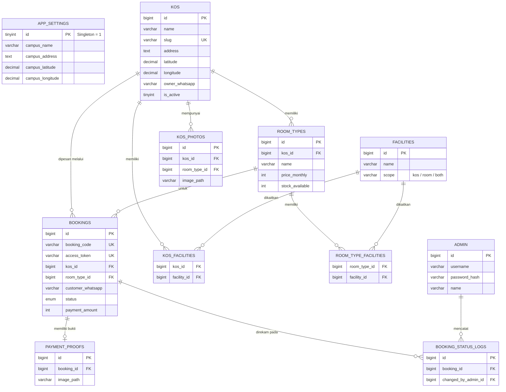

<div align="center">
  
  <h1 align="center">Sistem Informasi Manajemen Kos & Pemesanan (MVP)</h1>
  
  <p align="center">
    Platform modern untuk pencarian dan pemesanan kos di sekitar area kampus, dilengkapi dengan dashboard admin yang komprehensif.
  </p>

  <p align="center">
    
    
    
    
  </p>
</div>

---

##  Tujuan Proyek
Kos.id dikembangkan (sebagai bagian dari mata kuliah **Interaksi Manusia dan Komputer**) untuk menyelesaikan masalah konvensional pencarian tempat tinggal mahasiswa. Aplikasi ini menargetkan pencarian kos secara spesifik di sekitar kawasan universitas (khususnya *Universitas Ma'arif Nahdlatul Ulama, Kebumen*) dengan memberikan visibilitas penuh terkait fasilitas, ketersediaan kamar secara *real-time*, dan sistem pemesanan yang tidak rumit (tanpa perlu login pengguna).

---

##  Fitur Utama

###  Pengguna (Publik)
- **Pencarian Pintar**: Filter kos berdasarkan harga, fasilitas, jenis (putra/putri/campur), dan ketersediaan.
- **Peta Terintegrasi**: Visualisasi Iframe lokasi kos melalui koordinat Google Maps.
- **Booking Instan**: Pemesanan kamar tanpa pendaftaran akun. Cukup masukkan nama, kontak WhatsApp, dan tanggal masuk.
- **Cek Pesanan Mandiri**: Lacak status pesanan menggunakan kombinasi **Kode Booking** dan Nomor WhatsApp secara aman.
- **Upload Pembayaran**: Unggah bukti transfer (via QRIS) langsung pada halaman progres pesanan.

###  Administrator (Dashboard)
- **Manajemen Properti (Kos)**: Tambah, edit, dan nonaktifkan kos beserta fasilitas dan galerinya.
- **Manajemen Kamar**: Kontrol *stock* (ketersediaan kamar) dan penyesuaian tipe/harga kamar.
- **Manajemen Booking**: Menyetujui atau menolak bukti pembayaran dan konfirmasi pesanan (yang akan otomatis memotong *stock* kamar).
- **Pengaturan Global**: Mengatur titik fokus kampus pusat dan konfigurasi gerbang pembayaran (QRIS).

---

## 🛠️ Teknologi yang Digunakan

| Kategori | Teknologi | Deskripsi |
| :--- | :--- | :--- |
| **Framework & UI** |   | Next.js App Router (Server & Client Components) |
| **Styling** |   | Desain responsif, clean, dan komponen UI siap pakai |
| **Language** |  | Strict typing untuk mencegah *runtime error* |
| **Database** |  | Skema relasional yang kokoh via XAMPP |
| **Driver / ORM** | `mysql2/promise` | Koneksi database raw query yang ringan & cepat |

---

##  Arsitektur Database (ERD)

Aplikasi ini menggunakan desain relasional terstruktur. Berikut adalah visualisasi **Entity Relationship Diagram (ERD)** menggunakan sintaks Mermaid:



---

##  Cara Menjalankan Aplikasi (Instalasi Lokal)

### 1. Prasyarat Sistem
Pastikan Anda telah memasang:
- **Node.js** (Versi 18 LTS ke atas direkomendasikan)
- **XAMPP / MySQL Server**
- **Git**

### 2. Kloning Repositori
```bash
git clone https://github.com/Vraken9/Kos.id.git
cd Kos.id
```

### 3. Instalasi Dependensi
```bash
npm install
```

### 4. Konfigurasi Lingkungan (`.env.local`)
Buat file bernama `.env.local` pada *root directory* Anda, lalu salin pengaturan berikut (sesuaikan kredensial MySQL dengan instalasi XAMPP Anda):
```env
# Database (XAMPP Default)
DB_HOST=127.0.0.1
DB_PORT=3306
DB_USER=root
DB_PASSWORD=
DB_NAME=kos_id

# Security
JWT_SECRET=super_secret_key_123_change_me_in_production
NODE_ENV=development
```

### 5. Inisialisasi Database
Pastikan modul MySQL pada aplikasi XAMPP Anda **sudah berjalan (START)**.
Jalankan deretan script berikut secara berurutan:
```bash
# a. Buat struktur tabel dan schema
mysql -u root < database/schema.sql

# b. Masukkan data referensi awal (contoh Fasilitas Umum, Settings)
mysql -u root -D kos_id < database/seed.sql

# c. Eksekusi Script Data Dummy (30 Kos, Gambar Unsplash, Lokasi Kebumen)
npx tsx database/generate-dummy.ts

# d. Buat Akun Super Admin
npx tsx database/seed-admin.ts
```

### 6. Menjalankan Server Pengembangan
```bash
npm run dev
```
Buka browser Anda dan kunjungi `http://localhost:3000`.

---

##  Kredensial Akses

| Akses Level | URL / Halaman | Username | Password |
| :--- | :--- | :--- | :--- |
| **Publik** | `/` | *(Tidak butuh login)* | - |
| **Admin** | `/admin/login` | `admin` | `admin123` |

---

##  Pengembangan Lanjutan
Aplikasi saat ini berfokus pada **Minimum Viable Product (MVP)**. Potensi peningkatan di masa mendatang meliputi:
- **Integrasi Payment Gateway**: Midtrans / Xendit untuk *auto-verification* status pembayaran (menggantikan sistem unggah struk manual).
- **Akun Pengguna Khusus**: Halaman dashboard khusus pengguna (*tenant*) kos untuk fitur penagihan per bulan.
- **Sistem Rating & Ulasan**: Agar pengguna bisa merekomendasikan kos yang sudah pernah disewa.

<div align="center">
  <i>Dibuat dengan ❤️ untuk menyelesaikan permasalahan pencarian kos konvensional</i>
</div>
